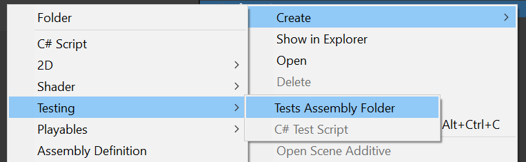
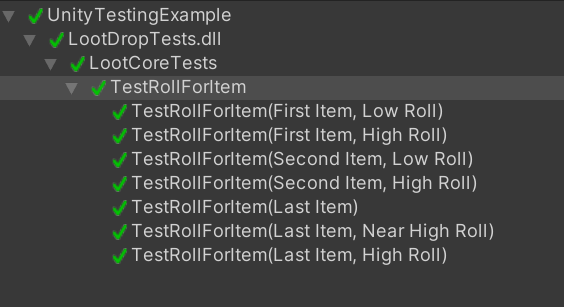

# Unit testing in Unity

This is an article-as-a-project example of my general setup for unit testing within Unity. It shows a few of what I consider best practices for testing within Unity. The target audience is intermediate-level developers and does not go into the basics of unit testing. For more beginner information I recommend checking out [Unity's Getting Started page.](https://docs.unity3d.com/Packages/com.unity.test-framework@1.1/manual/getting-started.html)

## Testing in Game Development
Testing in games is quite frequently something that is never done, or done after the fact. Why is it not common to test games in development? I think a lot of this comes down to not understanding *how* to test. But frequently code is written in such a way that makes it very difficult to test.

## Reasons For Testing In Games
Long term, if you want your game to be stable, it is wise to include some automated testing. Automated testing can help you avoid things like:
 * Really hard to test bugs that occur in weird edge cases.
 * Corrupted save files due to unexpected 
 * Game play logic that 'usually works' but sometimes just...doesn't?
 * Need to rewrite a big chunk of code and ensure that the new system works identical to the old.
 * The #1 Reason: _Fixing one thing...and breaking another!_ This happens more often than I'd like to admit.
 * 

## Unit Testing Vs. Other Tests
In the past I've used testing to test rules engines for games. When those games had issues, and a bug was created, I'd create a new test with the bug number and add it to the suite. I've also used tests in a 'bot' fashion to play through a game and find unsolvable areas. I've also used them to ensure that things like web requests worked as I expected them to.

But really? Honestly? These were not good tests. These tests could have been better. The #1 issue with writing tests is _maintainability_. Noone wants to spend a lot of time keeping tests up to date as things change. Most of these tests suffered from requiring too much effort to maintain. Sometimes they were just abandoned and forgotten about. And the main issue? They were not *unit* tests. 

Unit tests test one thing aka a 'unit', such as a function. Not a big function, mind you, a small one, with ALL potential types of inputs and outputs.

In this example project we test the following unit:

```csharp
public static string RollForItem(List<LootTableEntry> tableEntries, IRandom random)
{
    ...
}
```

If we want to test it, what are all the cases we need to cover?
  * What happens if we pass null into this function?
  * What happens if `tableEntries` is empty/has one/has many items?
  * What happens if the `weight` is zero?


TODO: Unit testing vs. integration tests, big tests, and view tests. What is a good test and what is a bad test?

## The Other Big Problem: Dependencies

While I talk more about this in my [Functional Core/Imperative Shell article](http://enemyhideout.com/2022/04/taming-the-code-jungle-fc-is-in-game-development/), the other issue with testing is how you write the code. Writing testable code means writing code that is small and has a clear goal. Consider this probably all too real looking mono behaviour:

```csharp
public MyMonoBehaviour : MonoBehaviour
{
    public FxManager fxManager;
    public PathingManager pathManager;
    public AnimationUtility animUtility;
    
    ...

    public void KillShot(Unit enemyUnit)
    {
        fxManager.PlaySplosions();
        pathManager.PushBackUnit(enemyUnit);
    }
    
    ...
} 
```

If you wanted to test something like this, how would you? You need an FXManager, PathingManager, and an AnimationUtility. Maybe you don't need an AnimationUtility, but you have to initialize one anyway, even tho its unrelated to what you want to test. What we need is for our code to be isolated, with only the data it needs. But really, it would be mad to test code like this. What we really want to do is test the functional core of this code. This code is shell code, and should not be tested.

## The MonoBehaviour Dependency Problem

This also illustrates another issue with testing in Unity: Monobehaviours are not very testable. Most of your game code should not be in a `MonoBehaviour`(or `ScriptableObject`). This is one of the biggest problems with most Unity tutorials. You can see how the structure of this code is such that the `LootDropper` monobehaviour is a shell class that calls into `LootCore` which does the actual work.

```csharp
private void RollForItem()
{
    LootTableData tableData = TableForId(lootTables, tableToUse);
    string itemDropped = LootCore.RollForItem(tableData.Entries, _random);
    Debug.Log($"Dropped item {itemDropped}.");
}
```

I frequently find this to be a preferred method to write and test code: its code _used_ by monobehaviours, instead of it _being_ a monobehaviour. You don't necessarily need to make a separate 'core' class, but you can instead encapsulate your logic within the monobehaviour as well if necessary.

## Testing Setup

So in order to create a test in Unity, first we need some code to test, and also to create a test fixture. The test fixture will run the tests, and display the results within unity's Test Runner.

 ## Using Assembly References
When setting up tests, its important to use Assemblies (aka Assembly Definitions) for your tests. I also use them for my code, which is less important here, but in general a good practice. 

You can create a test assembly via the `Create->Testing->Tests Assembly Folder`


You can then also create a test script within that folder via Create C# Test Script. This will give you some basic example code. But we'll ignore that.

The test class we'll be making looks more like:
```csharp
...
using NUnit.Framework;

public class LootCoreTests
{
    [Test]
    public void TestRollForItem([ValueSource(nameof(RollForItemTestCases))] RollForItemTestCase testCase)
    {
        ...
    }
}
```


Tests can either be Editor tests or Play Mode tests, and it is unintuitive how to correctly set up your tests. I have never made a test that was for Play Mode, and I feel like if you are making Play Mode tests, you are not doing unit tests. Avoid setting up Play Mode Tests by ensuring your testing assembly is set to only compile for the editor (which is how unity knows its an Editor only test).


 * Set up AssemblyInfo.cs with internal flags and using `internal` to expose tests to.
 * Setting up your tests to run fast.
 * The TestRunner Interface


## Making Test Cases Data-Driven
One of the reasons why tests are either abandoned or never done is the maintenance required. Tests can be difficult to maintain, but much of this is about how you write the tests. For example, let's say that we have a number of tests like so:
```csharp
[Test]
public void TestLootDropWithMultipleItems()
{
    var random = new NotRandom();
    var lootTable = new LootTable("thing1","thing2");
    var output = LootCore.RollForItem(lootTable, random);
    Assert.That(output, Is.EqualTo("thing1"); 
}

[Test]
public void TestLootDropWithOneItem()
{
    var random = new NotRandom();
    var lootTable = new LootTable("thing1");
    var output = LootCore.RollForItem(lootTable, random);
    Assert.That(output, Is.EqualTo("thing1"); 
}

[Test]
public void TestLootDropWithNoItems()
{
    var random = new NotRandom();
    var lootTable = new LootTable("thing1","thing2");
    var output = LootCore.RollForItem(lootTable, random);
    Assert.That(output, Is.EqualTo(null); 
}

... etc ...
```

It is quite common to see tests like this. These test are very repetitive. They have similar structures. It is likely that if the testing patterns change, we'd have to update *all* of these tests. That's a lot of work. Wouldn't it be better to have one test that is simply re-used with different data? nUnit's ValueSource attribute allows us to do this.

```csharp
[Test]
public void TestRollForItem([ValueSource(nameof(RollForItemTestCases))] RollForItemTestCase testCase)
{
    var notRandom = new NotRandom(testCase.RandomValue);
    var output = LootCore.RollForItem(testCase.Entries, notRandom);
    Assert.That(output, Is.EqualTo(testCase.Expected));
}

```

You can see within the above that what we're doing here is _parameterizing_ our test. Our test will get passed a `RollForItemTestCase` and this data will be used to describe the test and define our expected outcome. This is done using the [Value Source](https://docs.nunit.org/articles/nunit/writing-tests/attributes/valuesource.html) attribute of nUnit. 

```csharp
public class RollForItemTestCase
{
    public string Description;
    public List<LootTableEntry> Entries;
    public float RandomValue;
    public string Expected;

    public override string ToString()
    {
        return Description;
    }
}
```
A test case is simply a data object passed into a class. It does not need to extent When defining test cases this way, you need to override the `ToString` method. This allows the nUnit interface to be able to display a human readable description:




We can now define our tests as a list like so (the below is psuedo code):
```csharp
public static List<RollForItemTestCase> RollForItemTestCases = new List<RollForItemTestCase>()
{
    new RollForItemTestCase
    {
        Description = "Multiple Items",
        Entries = "thing1","thing2",
        RandomValue = 0.0f,
        Expected = "thing1"
    }
    ...
};
```
This makes creating new test cases much simpler, and reduces the duplication!

## The [TestCase] Attribute 

I should mention that it is also possible to create test cases via [TestCase](https://docs.nunit.org/articles/nunit/writing-tests/attributes/testcase.html) attribute:

```csharp
[TestCase(12, 3, 4)]
[TestCase(12, 2, 6)]
[TestCase(12, 4, 3)]
public void DivideTest(int n, int d, int q)
{
    Assert.AreEqual(q, n / d);
}
```
I have never used this attribute, due to it being useful only in simplistic tests. The lack of any description on the attribute also means its difficult to understand what is being tested. It also does not allow you to re-use static data, which is our next topic.

### Re-using static data in Test Cases
When creating data for tests its important to always use mock data. *never* use data that is 'production' data ie: data that is part of your game. This will mean every time you update the production data you need to update your tests. By using test cases, we can define static data that can be re-used among our test cases:

```csharp

private static float _defaultWeight = 1.0f;
private static string _item1 = "Item1";
private static string _item2 = "Item2";
private static string _item3 = "Item3";

private static List<LootTableEntry> _testEntries1 = new List<LootTableEntry>()
{
    new LootTableEntry
    {
        Weight = _defaultWeight,
        Item = _item1
    },
    new LootTableEntry
    {
        Weight = _defaultWeight,
        Item = _item2
    },
    new LootTableEntry
    {
        Weight = _defaultWeight,
        Item = _item3
    }
};

```
Now when we create our test cases we can re-use this data:
```csharp
public static List<RollForItemTestCase> RollForItemTestCases = new List<RollForItemTestCase>()
    {
        new RollForItemTestCase
        {
            Description = "First Item, Low Roll",
            Entries = _testEntries1,
            RandomValue = 0.0f,
            Expected = _item1
        },
        new RollForItemTestCase
        {
            Description = "First Item, High Roll",
            Entries = _testEntries1,
            RandomValue = 0.99999f,
            Expected = _item1
        },
        
        /// etc... 
        
```
Again, this goes back to maintainability of tests being just as important as the rest of your code: creating test data that can be re-used makes making tests that much easier!

## Mocks and Stubs

A common testing requirement is the creation of what are frequently called mocks and stubs. These go by many names such as 'test doubles', fakes, etc. We'll just call these 'mocks'. A 'mock' is a class that looks and acts predictably in order to provide a replacement for a larger, more complicated class that cannot be easily initialized for purposes of testing. For example, you may want to mock out an object for testing that would normally require some kind of net connection that you don't have at testing time.
Libraries such as [nSubstitute](https://nsubstitute.github.io/) allow for the easy creation of mocks, allowing you to work around dependency problems.


### Getting Rid of Mocks and Stubs

Mocks are yet another potential roadblock to maintainability. Having to create mocks for testing purposes requires you to write code twice. Mocks have to be maintained alongside your production code. So as mentioned before, using FC/IS to structure your code is the preferred way for me to avoid this additional maintenance. 

 As I have talked and presented on this topic, a frequent question I get is 'why don't you like mocks'? I want to be clear that they have their place, and I frequently use them. But sometimes they are completely unnecessary if the code is simply structured in a way that doesn't require these dependencies. So don't take this as advice that you shouldn't use mocks, but simply to structure your code in a way that doesn't require them in the first place.

## Using FC/IS to write testable code.
TODO: Explain how the FC/IS pattern relates to unit testing.

http://enemyhideout.com/2022/04/taming-the-code-jungle-fc-is-in-game-development/

## Randomness in Tests
TODO: Talk about IRandom and why you should write code this way.

## Key Takeaways
* Write **unit** tests not 'big' tests.
* Avoid adding your testable code to Monobehaviours. 
* Write Editor tests.
* Use test cases for maintainability and readability.
* Use FC/IS to avoid mocks and stubs to increase maintainability.

