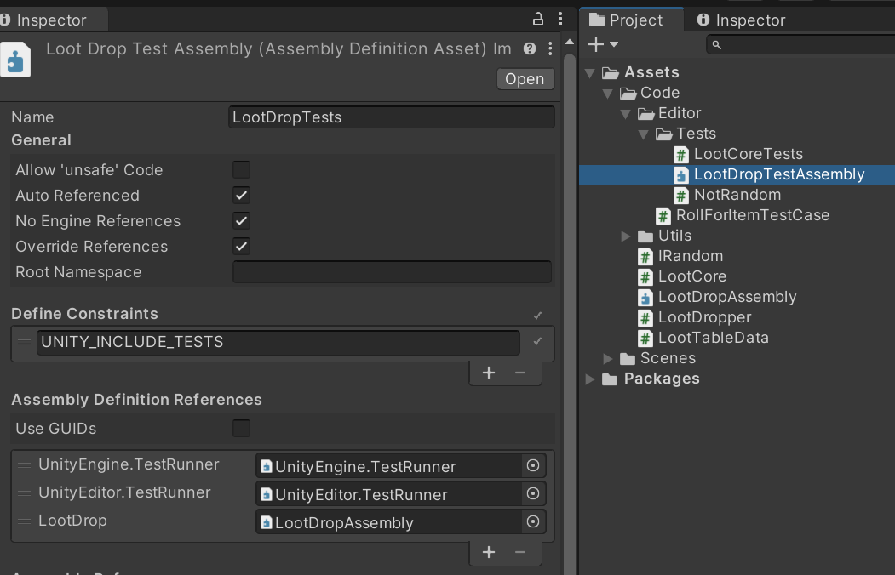
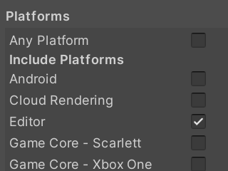

# Unit testing in Unity

This is an article-as-a-project example of my general setup for unit testing within Unity. It shows a few of what I consider best practices for testing within Unity. The target audience is intermediate-level developers and does not go into the basics of unit testing. For more beginner information I recommend checking out [Unity's Getting Started page.](https://docs.unity3d.com/Packages/com.unity.test-framework@1.1/manual/getting-started.html)

## Testing in Game Development
Testing in games is quite frequently something that is never done, or done after the fact. Why is it not common to test games in development? I think a lot of this comes down to not understanding *how* to test. But frequently code is written in such a way that makes it very difficult to test.

## Reasons For Testing In Games
TODO:
 * Talk about stability, specifically long term stability.
 * Rules engines and how to test them.
 * MonoBehaviors are bad for testing, how to avoid testing them (spoiler: FC/IS).

## Testing Setup
TODO:
 ## Using assembly references correctly.
When setting up tests, its important to understand and use assemblies for your tests. I also use them for my code, which is less important, but in general a good practice. 

Tests can either be Editor tests or Play Mode tests, and it is unintuitive how to correctly set up your tests. I have never made a test that was for Play Mode, and I feel like if you are making Play Mode tests, you are not doing unit tests. Avoid setting up Play Mode Tests by ensuring your testing assembly is set to only compile for the editor (which is how unity knows its an Editor only test).

 * Set up AssemblyInfo.cs with internal flags.
 * Setting up your tests to run fast.
 * The TestRunner Interface

## Unit Testing Vs. Other Tests
TODO: Unit testing vs. integration tests, big tests, and view tests. What is a good test and what is a bad test?

## ValueSource and Test Cases
TODO: Talk about how to structure tests by using a test case and ValueSourceAttribute

https://docs.nunit.org/articles/nunit/writing-tests/attributes/valuesource.html

## Mocks and Stubs
TODO: Talk about mocks and stubs and how to avoid them.

## Using FC/IS to write testable code.
TODO: Explain how the FC/IS pattern relates to unit testing.

http://enemyhideout.com/2022/04/taming-the-code-jungle-fc-is-in-game-development/

## Randomness in Tests
TODO: Talk about IRandom and why you should write code this way.
